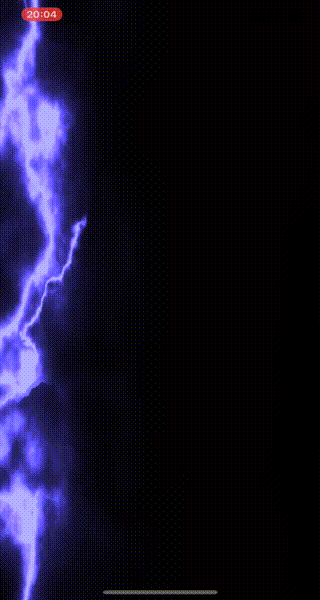
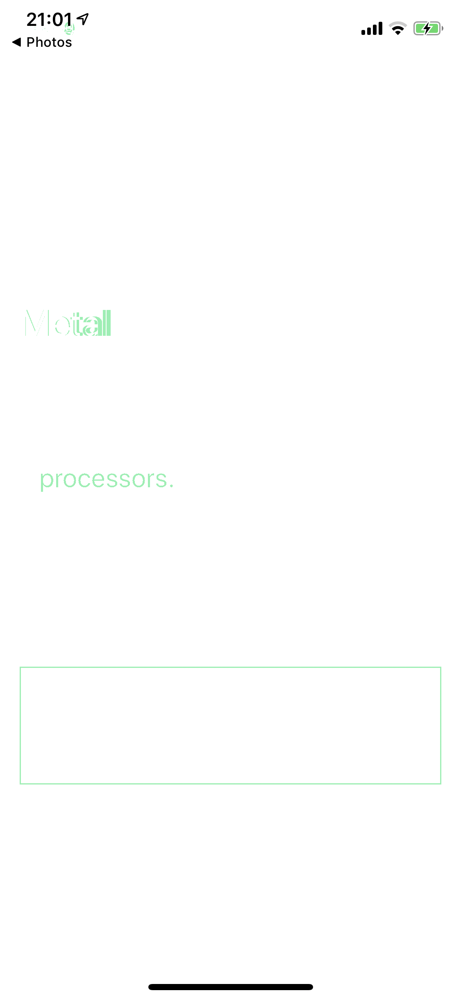

# GPUOperator

[](https://developer.apple.com/swift)
[](https://cocoapods.org/pods/GPUOperator)
[](https://github.com/Carthage/Carthage)
[](https://cocoapods.org/pods/GPUOperator)
[](https://cocoapods.org/pods/GPUOperator)

**Metal** is used for rendering graphics and performing parallel computations like image processing. But,

**there are many boiler plates to use Metal normally.**
- Creating Metal device
- Creating command queue
- Creating library, taking caring for which bundle includes it.
- PipelineState, CommandBuffer, Threadgroup ......... :scream:

This library simplifies these steps.

## Examples

### Graphics Shader
#### [Implementation](https://github.com/horita-yuya/GPUOperator/blob/master/Example/Example/Thundershower/ThundershowerViewController.swift)

|Thundershower|Fourier Series|
|---|---|
|||
|[Reference](http://glslsandbox.com)|[Concept](http://mathworld.wolfram.com/FourierSeries.html)

- Reference: [http://glslsandbox.com/](http://glslsandbox.com/)

### Realtime Video Processing
#### [Implementation](https://github.com/horita-yuya/GPUOperator/blob/master/Example/Example/Camera/CameraViewController.swift)

| Edge Detection | Color Conversion |
|---|---|
||
|[Prewitt](https://github.com/horita-yuya/GPUOperator/blob/master/Example/Example/Camera/Prewitt.metal)|[Monochrome](https://github.com/horita-yuya/GPUOperator/blob/master/Example/Example/Camera/Monochrome.metal)

### Image Processing: Two Images Difference
#### [Implementation](https://github.com/horita-yuya/GPUOperator/blob/master/Example/Example/ImageDifference/ImageDifferenceViewController.swift)

|Before|After|Difference|
|---|---|---|
|||

#### This infers
- Bold font was changed to regular font.
- The last `processors.` word was removed.
- The border disappeared.

## Getting Started
### 1. Define kernel function and kernel class
```swift
#include <metal_stdlib>
using namespace metal;

kernel void monochrome(texture2d<half, access::read_write> dest [[ texture(0) ]],
                       texture2d<half, access::read_write> source [[ texture(1) ]],
                       uint2 gid [[ thread_position_in_grid ]]) {
    half3 color = source.read(gid).rgb;
    half max_color = fmax3(color.r, color.g, color.b);

    dest.write(half4(half3(max_color), 1), gid);
}
```

```swift
import GPUOperator

final class Monochrome: Kernel {
    static let functionName: String = "monochrome"
}
```

### 2. Setup GPUOperator instance
```swift
let gpuOperator = try? GPUOperator()
try? gpuOperator?.install(kernel: Monochrome())
```

### 3. Configure Rendering Process
```swift
let renderingView = RenderingView(frame: .zero)
renderingView.gpuOperator = gpuOperator
renderingView.run()
```

The `run()` function just starts displaylink process inside RenderingView.
If you want to use MTLView (Metal Standard class), following example would be helpful.
```swift
import MetalKit
extension ViewController: MTKViewDelegate {
    func mtkView(_ view: MTKView, drawableSizeWillChange size: CGSize) {}

    func draw(in view: MTKView) {
        autoreleasepool {
            guard let drawable = view.currentDrawable else { return }
            gpuOperator?.commit(drawable: drawable)
        }
    }
}
```

## Requirements
- Swift 5.0
- iOS 12.0+
- Any simulators are unsupported.

## Installation

### Cocoapods
```ruby
pod 'GPUOperator'
```

### Carthage
```ruby
github "horita-yuya/GPUOperator"
```

## License

GPUOperator is available under the MIT license.
